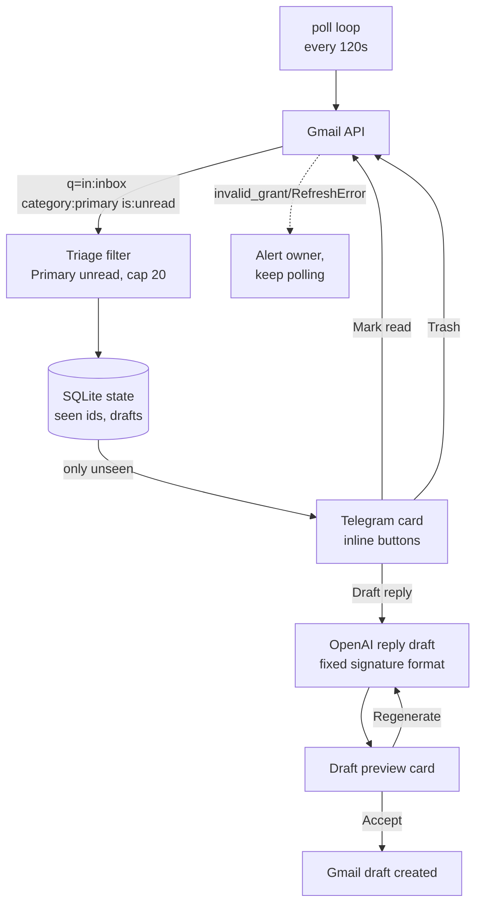

# Gmail Triage Bot

**Resilient Gmail→Telegram triage bot with AI-drafted replies — a failed poll never kills the process.**

[](https://github.com/M1zz1-ai/gmail-triage-bot/actions/workflows/ci.yml)

[](LICENSE)

A single asyncio process watches a Gmail inbox, and for every new Primary-inbox
message it sends a Telegram card with inline actions: mark read, trash, or draft
a reply. Reply drafts are written by an LLM in a fixed professional format, shown
as a preview you can accept (saved as a Gmail draft) or regenerate. The whole
thing is built around one promise: **transient Gmail / Telegram / LLM failures are
logged and retried, never fatal.**

> 🇷🇺 Русская версия: **[README.ru.md](README.ru.md)**

📊 The same story as a full-screen deck: **[it went quiet, nothing had crashed](https://m1zz1-ai.github.io/gmail-triage-bot/)** — eight screens on the expired token that killed v1, and the loop that survives it.

## Architecture



## Features

- **Inbox triage over Telegram.** Every unread Primary message becomes a card
  (`new_email_card`) with one-tap **Mark read**, **Trash**, and **Draft reply**
  buttons — no context-switch to the Gmail UI.
- **AI reply drafts in a fixed format.** The draft LLM produces a formal reply
  with an exact, non-negotiable signature block; the owner's identity is injected
  from config, never hardcoded. A **Regenerate** action asks for a meaningfully
  different version.
- **Accept = real Gmail draft.** Accepting a preview creates an actual Gmail draft
  on the thread, ready to review and send from any Gmail client.
- **Provider seam (OpenAI default, Anthropic switch-back).** Draft generation sits
  behind a one-function factory; `LLM_PROVIDER` picks the backend. Default model
  `gpt-4.1-mini`, override with `GMAIL_DRAFT_MODEL`.
- **Resilient by design.** The poll loop catches every per-cycle error, logs it,
  and continues; a dead Gmail refresh token alerts the owner instead of crashing.
- **Fail-loud config.** All secrets come from one env file; a missing key raises a
  `ConfigError` naming it, so a misconfigured deploy never runs half-blind.

## Quickstart

**Prerequisites:** Python 3.14, [uv](https://docs.astral.sh/uv/), a Telegram bot
token from [@BotFather](https://t.me/BotFather), an OpenAI API key, and a Google
Cloud OAuth client (scope `gmail.modify`).

```bash
uv sync --dev                                   # create the venv, install deps
mkdir -p ~/.config/gmail-triage-bot
cp .env.example ~/.config/gmail-triage-bot/.env # then fill in real values
uv run python -m gmail_bot.auth                 # one-time OAuth: mint the refresh token
uv run python -m gmail_bot                       # start polling
```

`python -m gmail_bot.auth` opens the Google consent screen once, stores the minted
`GMAIL_REFRESH_TOKEN`, and immediately runs a guarded live end-to-end check (it
only ever touches a self-test email sent from the account to itself) so a single
"Allow" click proves the whole pipeline before you deploy.

A systemd unit template lives in [`systemd/`](systemd/) — fill in the `CHANGE_ME`
placeholders.

## Configuration

All config comes from `~/.config/gmail-triage-bot/.env` (documented in
[`.env.example`](.env.example)). No secret is ever hardcoded.

| Key | Required | Purpose |
| --- | --- | --- |
| `TELEGRAM_BOT_TOKEN` | ✅ | Bot token from @BotFather (a suffixed `_GMAIL` variant wins if set) |
| `TELEGRAM_CHAT_ID` | ✅ | Chat id that receives the cards and alerts |
| `GMAIL_CLIENT_ID` / `GMAIL_CLIENT_SECRET` | ✅ | OAuth client credentials |
| `GMAIL_REFRESH_TOKEN` | ✅* | Long-lived Gmail grant (or a short-lived `GMAIL_ACCESS_TOKEN`) |
| `GMAIL_TOKEN_URI` / `GMAIL_SCOPES` | ✅ | OAuth token endpoint + scopes |
| `GMAIL_SELF_ADDRESS` / `GMAIL_OWNER_NAME` / `GMAIL_OWNER_PHONE` | ✅ | Signature identity injected into the reply prompt |
| `OPENAI_API_KEY` | ✅ | Reply-draft generation (default provider) |
| `GMAIL_DRAFT_MODEL` | — | Override the draft model (default `gpt-4.1-mini`) |
| `LLM_PROVIDER` / `ANTHROPIC_API_KEY` | — | Switch back to Anthropic if desired |

\* Either a refresh token (production) or a short-lived access token (a one-off
live proof run) satisfies Gmail auth.

## Design notes / war stories

**The dead refresh token that killed v1.** The first version of this bot was an
n8n workflow. It went silent one day because its Gmail OAuth grant expired
(`invalid_grant`), and n8n's answer to a failing node is to stop the execution —
so a single expired token took the whole bot offline with no signal. The Python
rewrite treats that exact failure as a first-class, survivable event: the poll
loop `while True` wraps each cycle, and on `RefreshError`/`invalid_grant` it sends
the owner a re-auth message and **keeps looping** (a later cycle recovers once the
token is refreshed). More broadly, every poll cycle is `try/except`-guarded —
"poll cycle failed; will retry next cycle" — so one bad message, Gmail hiccup, or
Telegram timeout never ends the process (`gmail_bot/__main__.py`).

<picture>
  <source media="(prefers-color-scheme: dark)" srcset="docs/img/stopping-is-not-error-handling-dark.svg">
  
</picture>


**The 404 reply-target race.** Early reply callbacks encoded a *messageId* as the
reply target. That works for a standalone message, but the moment a message lives
inside an existing Gmail thread, fetching it by that id 404s — so "Draft reply"
would intermittently fail depending on thread shape. The fix is a
resolve-and-retry: on a 404, the bot resolves the message's real `threadId` and
retries the fetch once, and only a genuinely vanished target degrades to a clean
"reply target gone" card instead of a stack trace (`_resolve_thread` in
`gmail_bot/telegram_bot.py`).

<picture>
  <source media="(prefers-color-scheme: dark)" srcset="docs/img/resolve-and-retry-dark.svg">
  
</picture>


**Anthropic→OpenAI in one seam.** Draft generation depends only on a narrow
contract — `build_draft_builder(config)` returns something with a single
`generate(thread_context, prev_draft)` method. When the Anthropic key had to be
retired, moving to OpenAI meant adding one `OpenAIDraftBuilder` alongside the
existing one and flipping the default in the factory; the prompt, the Telegram
cards, and the accept/regenerate flow were untouched. The Anthropic path stays as
a config-selectable switch-back. Model ids are verified against the live API, not
guessed. The lesson baked into the layout: **depend on a capability, not a vendor
SDK.**

## Testing

The suite is fully offline — Gmail, Telegram, and both LLM SDKs are faked, so no
network or credentials are needed. 97 tests cover config validation, the triage /
card flow, the resilience contract, the 404 resolve-and-retry, and both provider
paths.

```bash
uv run pytest -q      # run the tests
uv run ruff check .   # lint
```

## Project layout

```
gmail_bot/
  __main__.py     # entrypoint + the resilient 120s poll loop
  config.py       # env loading, fail-loud on missing keys
  auth.py         # one-time OAuth bootstrap + guarded live E2E
  gmail.py        # Gmail client, triage query, thread-context builder
  drafts.py       # LLM provider seam (OpenAI default, Anthropic switch-back)
  telegram_bot.py # aiogram cards, inline handlers, 404 resolve-and-retry
  state.py        # SQLite: seen message ids + pending drafts
  live_smoke.py   # guarded self-only live end-to-end check
  smoke.py        # on-demand live-smoke entrypoint
scripts/          # standalone live-smoke CLI
systemd/          # service template (CHANGE_ME placeholders)
tests/            # offline unit tests
```

## License

MIT — see [LICENSE](LICENSE).
