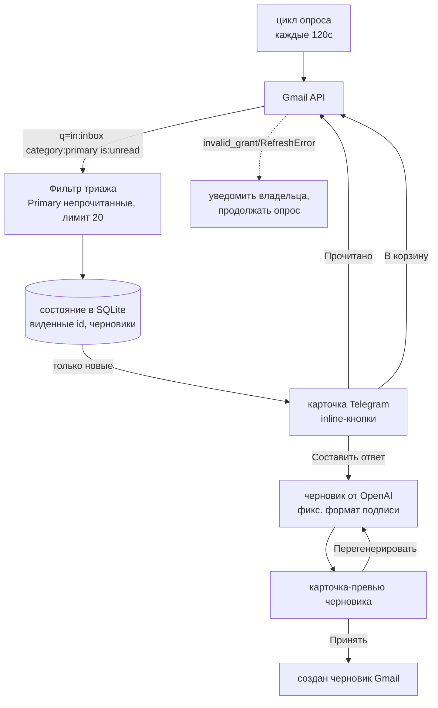

# Gmail Triage Bot

**Отказоустойчивый бот Gmail→Telegram с черновиками ответов от ИИ — сбой одного опроса никогда не роняет процесс.**

[](https://github.com/M1zz1-ai/gmail-triage-bot/actions/workflows/ci.yml)

[](LICENSE)

Один asyncio-процесс следит за входящими Gmail и на каждое новое письмо в разделе
Primary присылает в Telegram карточку с кнопками: пометить прочитанным, в корзину
или составить ответ. Черновики ответов пишет LLM в фиксированном деловом формате —
показывается превью, которое можно принять (сохранится как черновик Gmail) или
перегенерировать. Всё построено вокруг одного принципа: **временные сбои Gmail /
Telegram / LLM логируются и повторяются, но никогда не фатальны.**

> 🇬🇧 English version: **[README.md](README.md)**

📊 Та же история полноэкранной витриной: **[бот замолчал, ничего не упало](https://m1zz1-ai.github.io/gmail-triage-bot/)** — восемь экранов о протухшем токене, убившем первую версию, и о петле, которая это переживает.

## Архитектура



## Возможности

- **Триаж входящих через Telegram.** Каждое непрочитанное письмо Primary
  становится карточкой (`new_email_card`) с кнопками **Прочитано**, **В корзину**
  и **Составить ответ** — без переключения в интерфейс Gmail.
- **Черновики ответов от ИИ в фиксированном формате.** LLM формирует деловой
  ответ со строгим блоком подписи; личность владельца берётся из конфигурации и
  никогда не зашита в код. Кнопка **Перегенерировать** просит заметно иной вариант.
- **Принять = реальный черновик Gmail.** Принятие превью создаёт настоящий черновик
  на цепочке письма — его можно проверить и отправить из любого клиента Gmail.
- **Шов провайдера (OpenAI по умолчанию, откат на Anthropic).** Генерация
  черновиков спрятана за фабрикой из одной функции; бэкенд выбирает `LLM_PROVIDER`.
  Модель по умолчанию `gpt-4.1-mini`, переопределяется через `GMAIL_DRAFT_MODEL`.
- **Отказоустойчивость по замыслу.** Цикл опроса ловит любую ошибку итерации,
  логирует и продолжает; мёртвый refresh-токен Gmail уведомляет владельца, а не
  роняет процесс.
- **Громкий отказ конфигурации.** Все секреты — из одного env-файла; отсутствующий
  ключ вызывает `ConfigError` с его именем, поэтому кривой деплой не запустится
  вслепую.

## Быстрый старт

**Требуется:** Python 3.14, [uv](https://docs.astral.sh/uv/), токен Telegram-бота
от [@BotFather](https://t.me/BotFather), ключ OpenAI API и OAuth-клиент Google
Cloud (scope `gmail.modify`).

```bash
uv sync --dev                                   # создать venv и поставить зависимости
mkdir -p ~/.config/gmail-triage-bot
cp .env.example ~/.config/gmail-triage-bot/.env # затем впишите реальные значения
uv run python -m gmail_bot.auth                 # разовый OAuth: получить refresh-токен
uv run python -m gmail_bot                       # запустить опрос
```

`python -m gmail_bot.auth` один раз открывает экран согласия Google, сохраняет
полученный `GMAIL_REFRESH_TOKEN` и сразу прогоняет защищённую живую E2E-проверку
(трогает только тестовое письмо, отправленное с аккаунта самому себе) — так один
клик «Allow» доказывает работоспособность всего конвейера ещё до деплоя.

Шаблон systemd-юнита лежит в [`systemd/`](systemd/) — заполните заглушки
`CHANGE_ME`.

## Конфигурация

Вся конфигурация — из `~/.config/gmail-triage-bot/.env` (описана в
[`.env.example`](.env.example)). Ни один секрет не зашит в код.

| Ключ | Обязателен | Назначение |
| --- | --- | --- |
| `TELEGRAM_BOT_TOKEN` | ✅ | Токен бота от @BotFather (вариант с суффиксом `_GMAIL` в приоритете) |
| `TELEGRAM_CHAT_ID` | ✅ | Chat id, куда идут карточки и уведомления |
| `GMAIL_CLIENT_ID` / `GMAIL_CLIENT_SECRET` | ✅ | Учётные данные OAuth-клиента |
| `GMAIL_REFRESH_TOKEN` | ✅* | Долгоживущий грант Gmail (или короткий `GMAIL_ACCESS_TOKEN`) |
| `GMAIL_TOKEN_URI` / `GMAIL_SCOPES` | ✅ | Точка обмена токена + scopes |
| `GMAIL_SELF_ADDRESS` / `GMAIL_OWNER_NAME` / `GMAIL_OWNER_PHONE` | ✅ | Личность для подписи, подставляется в промпт ответа |
| `OPENAI_API_KEY` | ✅ | Генерация черновиков (провайдер по умолчанию) |
| `GMAIL_DRAFT_MODEL` | — | Переопределить модель черновиков (по умолчанию `gpt-4.1-mini`) |
| `LLM_PROVIDER` / `ANTHROPIC_API_KEY` | — | Откат на Anthropic при желании |

\* Аутентификацию Gmail закрывает либо refresh-токен (прод), либо короткий
access-токен (разовый живой прогон).

## Заметки по дизайну / истории из окопов

**Мёртвый refresh-токен, убивший v1.** Первая версия бота была воркфлоу n8n.
Однажды он замолчал, потому что грант Gmail OAuth протух (`invalid_grant`), а
реакция n8n на упавшую ноду — остановить выполнение: единственный просроченный
токен уронил весь бот без единого сигнала. Переписанная версия на Python считает
именно этот сбой штатным и переживаемым: цикл опроса `while True` оборачивает
каждую итерацию и при `RefreshError`/`invalid_grant` шлёт владельцу сообщение о
переавторизации и **продолжает крутиться** (следующая итерация восстановится,
как только токен обновят). Шире — каждая итерация защищена `try/except`
(«poll cycle failed; will retry next cycle»), поэтому одно плохое письмо, сбой
Gmail или таймаут Telegram никогда не завершают процесс (`gmail_bot/__main__.py`).

<picture>
  <source media="(prefers-color-scheme: dark)" srcset="docs/img/stopping-is-not-error-handling-dark.svg">
  
</picture>


**Гонка 404 на цели ответа.** Ранние колбэки ответа кодировали в качестве цели
*messageId*. Для отдельного письма это работает, но как только письмо живёт внутри
существующей цепочки Gmail, запрос по этому id даёт 404 — и «Составить ответ»
периодически падал в зависимости от формы цепочки. Починка — resolve-and-retry:
при 404 бот определяет настоящий `threadId` письма и повторяет запрос один раз, и
только по-настоящему исчезнувшая цель деградирует в аккуратную карточку «цель
ответа пропала» вместо трейсбека (`_resolve_thread` в `gmail_bot/telegram_bot.py`).

<picture>
  <source media="(prefers-color-scheme: dark)" srcset="docs/img/resolve-and-retry-dark.svg">
  
</picture>


**Anthropic→OpenAI одним швом.** Генерация черновиков зависит только от узкого
контракта — `build_draft_builder(config)` возвращает объект с единственным методом
`generate(thread_context, prev_draft)`. Когда ключ Anthropic пришлось вывести из
эксплуатации, переход на OpenAI свёлся к добавлению одного `OpenAIDraftBuilder`
рядом с существующим и смене значения по умолчанию в фабрике; промпт, карточки
Telegram и поток принять/перегенерировать остались нетронутыми. Путь Anthropic
сохранён как переключаемый в конфиге откат. Id моделей проверены по живому API, а
не угаданы. Урок, зашитый в структуру: **завись от способности, а не от SDK
вендора.**

## Тесты

Набор полностью офлайн — Gmail, Telegram и оба SDK LLM подменены фейками, так что
сеть и учётные данные не нужны. 97 тестов покрывают валидацию конфигурации, поток
триажа/карточек, контракт отказоустойчивости, resolve-and-retry на 404 и оба пути
провайдеров.

```bash
uv run pytest -q      # прогнать тесты
uv run ruff check .   # линтер
```

## Структура проекта

```
gmail_bot/
  __main__.py     # точка входа + отказоустойчивый цикл опроса (120с)
  config.py       # загрузка env, громкий отказ при отсутствии ключей
  auth.py         # разовый OAuth-бутстрап + защищённый живой E2E
  gmail.py        # клиент Gmail, запрос триажа, сборка контекста цепочки
  drafts.py       # шов провайдера LLM (OpenAI по умолчанию, откат Anthropic)
  telegram_bot.py # карточки aiogram, inline-обработчики, resolve-and-retry на 404
  state.py        # SQLite: виденные id писем + отложенные черновики
  live_smoke.py   # защищённая живая E2E-проверка (только self)
  smoke.py        # точка входа живого прогона по запросу
scripts/          # автономный CLI живого прогона
systemd/          # шаблон сервиса (заглушки CHANGE_ME)
tests/            # офлайн unit-тесты
```

## Лицензия

MIT — см. [LICENSE](LICENSE).
